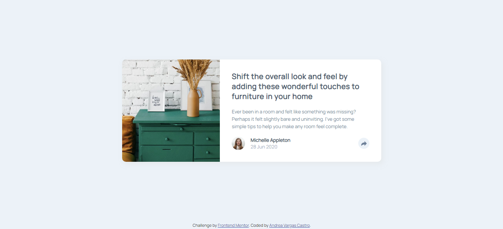

# Frontend Mentor - Article preview component solution

This is a solution to the [Article preview component challenge on Frontend Mentor](https://www.frontendmentor.io/challenges/article-preview-component-dYBN_pYFT). Frontend Mentor challenges help you improve your coding skills by building realistic projects. 


## Welcome! 👋

You are invited to review my coding solution on this front-end challenge of [Frontend Mentor](https://www.frontendmentor.io).

This project required basic knowledge of **HTML**, **CSS** and a tiny bit of **JavaScript**.

## Table of contents ✨

- [Overview](#overview)
  - [The challenge](#the-challenge)
  - [Screenshot](#screenshot)
  - [Links](#links)
- [My process](#my-process)
  - [Built with](#built-with)
  - [What I learned](#what-i-learned)
  - [Continued development](#continued-development)
  - [Useful resources](#useful-resources)
- [Author](#author)
- [Experience](#acknowledgments)

## Overview

### The challenge

**Objective**: build a article preview component that looking as close to the original design as possible.

Users should be able to:

- View the optimal layout for the component depending on their device's screen size
- See the social media share links when they click the share icon

### Screenshot



### Links

- Solution URL: [Solution](https://github.com/Yasmineili/fm-article-preview-avc)
- Live Site URL: [Live site](https://yasmineili.github.io/fm-article-preview-avc/)

## My process

### Built with

- Semantic HTML5 markup
- CSS custom properties
- Vanilla JavaScript
- Flexbox

### What I learned

I learned how to use CSS custom properties to create variables:
```css
.className {
  --varColor: hsl(217, 19%, 35%);
}
```

### Continued development

I'd like to keep focusing on CSS Flexbox because it was kind of difficult to order the share tab in the desktop design.

### Useful resources

- [Resource 1](https://stackoverflow.com/questions/57408400/how-to-conditionally-apply-a-css-class/57408614#57408614) - This helped me for understend CSS properties. It's a short and clear answer.
- [Resource 2](https://developer.mozilla.org/en-US/docs/Web/CSS/::before) - This is an amazing blog which helped me to understand pseudo-element. I'd recommend it to anyone still learning about CSS.

## Author

- Frontend Mentor - [@Yasmineili](https://www.frontendmentor.io/profile/Yasmineili)

## Experience

This is my first front end code challenge, I really liked coding it and learning in progress. I would like to receive feedback on my solution.

**Have good day!** 🚀